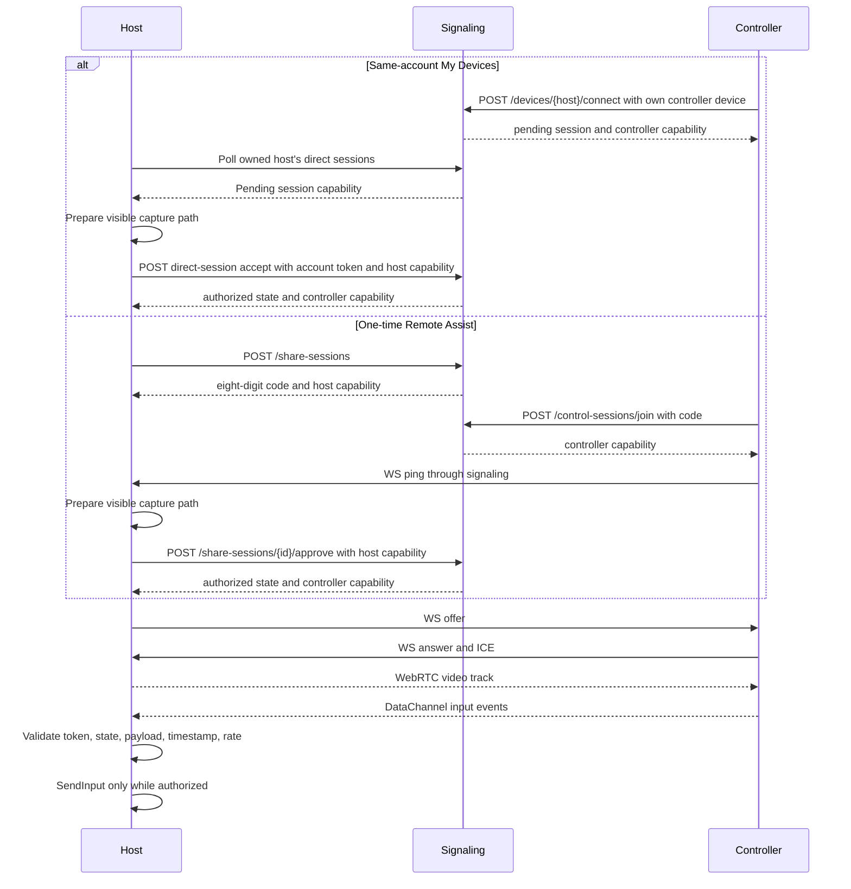

# Data Flow

```mermaid
sequenceDiagram
  participant H as Host
  participant S as Signaling
  participant C as Controller
  alt Same-account My Devices
    C->>S: POST /devices/{host}/connect with own controller device
    S-->>C: pending session and controller capability
    H->>S: Poll owned host's direct sessions
    S-->>H: Pending session capability
    H->>H: Prepare visible capture path
    H->>S: POST direct-session accept with account token and host capability
    S-->>H: authorized state and controller capability
  else One-time Remote Assist
    H->>S: POST /share-sessions
    S-->>H: eight-digit code and host capability
    C->>S: POST /control-sessions/join with code
    S-->>C: controller capability
    C->>H: WS ping through signaling
    H->>H: Prepare visible capture path
    H->>S: POST /share-sessions/{id}/approve with host capability
    S-->>H: authorized state and controller capability
  end
  H->>C: WS offer
  C->>H: WS answer and ICE
  H-->>C: WebRTC video track
  C-->>H: DataChannel input events
  H->>H: Validate token, state, payload, timestamp, rate
  H->>H: SendInput only while authorized
```

Disconnect, timeout, capture end, application close, or network loss clears host authorization and stops capture.
